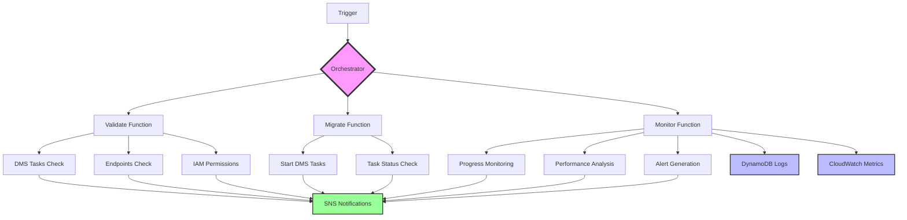

# 🚀 AWS DMS Migration Orchestrator


**🎯 Sistema de orquestación profesional para AWS Database Migration Service (DMS)**

Solución serverless completa que automatiza, monitorea y gestiona migraciones de bases de datos en AWS DMS con arquitectura de microservicios, manejo robusto de errores y observabilidad avanzada.

> 💼 **Proyecto de Portfolio**: Demuestra competencias avanzadas en AWS, Serverless Architecture, DevOps y Node.js

## 📋 Tabla de Contenidos

- [Características](#-características)
- [Arquitectura](#-arquitectura)
- [Instalación Rápida](#-instalación-rápida)
- [Configuración](#-configuración)
- [Uso](#-uso)
- [Despliegue](#-despliegue)
- [Monitoreo](#-monitoreo)
- [Testing](#-testing)
- [API Reference](#-api-reference)
- [Troubleshooting](#-troubleshooting)
- [Contribuir](#-contribuir)

## ✨ Características

### 🎯 Funcionalidades Principales
- **Validación Previa**: Verificación completa de configuración antes de migrar
- **Migración Automática**: Inicio y gestión de tareas DMS
- **Monitoreo en Tiempo Real**: Seguimiento continuo del progreso
- **Orquestación Avanzada**: Pipeline completo con manejo de errores
- **Notificaciones Inteligentes**: Alertas por email/SNS
- **Step Functions**: Workflows visuales para procesos complejos

### 🛠️ Tecnologías
- **AWS Services**: DMS, Lambda, Step Functions, SNS, DynamoDB, CloudWatch
- **Runtime**: Node.js 18+
- **IaC**: AWS SAM, Serverless Framework, Terraform
- **Monitoring**: CloudWatch Metrics, Custom Dashboards
- **Testing**: Jest, Simulación completa

### 🏗️ Modos de Operación
- **Script Standalone**: Ejecución directa con `node iniciar-migracion.js`
- **Lambda Functions**: Funciones individuales para cada proceso
- **Step Functions**: Workflow orquestado con estado visual
- **API Gateway**: Endpoints REST para integración
- **Scheduled**: Ejecución programada con EventBridge

## 🏛️ Arquitectura



### 📦 Componentes

| Componente | Función | Timeout | Memoria |
|------------|---------|---------|---------|
| **Orchestrator** | Coordina el pipeline completo | 15 min | 512 MB |
| **Validate** | Valida configuración DMS | 5 min | 512 MB |
| **Migrate** | Inicia tareas de migración | 10 min | 512 MB |
| **Monitor** | Monitorea progreso y rendimiento | 5 min | 512 MB |

## 🚀 Instalación Rápida

### Prerrequisitos
```bash
# AWS CLI configurado
aws --version

# Node.js 18+
node --version

# SAM CLI (opcional)
sam --version

# Serverless Framework (opcional)
serverless --version
```

### Instalación
```bash
# Clonar repositorio
git clone https://github.com/tu-usuario/migrador-dms.git
cd migrador-dms

# Instalar dependencias
npm install

# Configurar variables de entorno
cp .env.example .env
# Editar .env con tus valores AWS reales

# Ejecutar en modo simulación (sin AWS)
npm start
```

## ⚙️ Configuración

### Variables de Entorno Principales

```bash
# AWS Configuration
AWS_REGION=us-east-1
AWS_ACCESS_KEY_ID=your-access-key
AWS_SECRET_ACCESS_KEY=your-secret-key

# DMS Task ARN
DMS_TASK_ARN=arn:aws:dms:us-east-1:123456789012:task:your-task

# Notification Email
NOTIFICATION_EMAIL=admin@yourcompany.com

# Modo de Operación
TESTING_MODE=true          # true para testing
SIMULATE_MODE=true         # true para simulación sin AWS
USE_ORCHESTRATOR=true      # true para usar orquestador
```

### Configuración Avanzada

**thresholds.json**
```json
{
  "maxErroredTables": 0,
  "minProgressPercent": 10,
  "slowProgressTimeMs": 1800000,
  "maxExecutionTimeMs": 14400000
}
```

## 📖 Uso

### 1. Ejecución Básica (Script Standalone)

```bash
# Modo simulación (sin AWS)
npm start

# Modo testing con validación AWS
SIMULATE_MODE=false npm start

# Modo producción
TESTING_MODE=false SIMULATE_MODE=false npm start
```

### 2. Funciones Lambda Individuales

```bash
# Validar configuración
npm run invoke:validate

# Iniciar migración
npm run invoke:migrate

# Monitorear progreso
npm run invoke:monitor

# Ejecutar orquestador
npm run invoke:orchestrator
```

### 3. API REST (después del deploy)

```bash
# Iniciar migración via API
curl -X POST https://your-api-gateway-url/migrate \
  -H "Content-Type: application/json" \
  -H "x-api-key: your-api-key" \
  -d '{
    "taskArns": ["arn:aws:dms:..."],
    "restartFailedTasks": true
  }'
```

### 4. Programación con EventBridge

```bash
# La función se ejecuta automáticamente según el schedule configurado
# Por defecto: diariamente a las 2 AM (cron(0 2 * * ? *))
```

## 🚀 Despliegue

### Opción 1: AWS SAM (Recomendado)

```bash
# Build y deploy interactivo
sam build && sam deploy --guided

# Deploy automático
sam deploy --stack-name migrador-dms-prod \
  --parameter-overrides Environment=prod NotificationEmail=prod@company.com
```

### Opción 2: Serverless Framework

```bash
# Deploy desarrollo
npm run deploy:dev

# Deploy producción
npm run deploy:prod
```

### Opción 3: Terraform

```bash
# Crear infraestructura
terraform init
terraform plan -var="notification_email=admin@company.com"
terraform apply
```

### Opción 4: Manual CLI

Ver [DESPLIEGUE-ALTERNATIVO.md](DESPLIEGUE-ALTERNATIVO.md) para instrucciones detalladas.

## 📊 Monitoreo

### CloudWatch Dashboards

El sistema crea automáticamente dashboards con:
- **Métricas de Lambda**: Duración, errores, invocaciones
- **Métricas DMS**: Progreso, throughput, errores
- **Alertas**: Configurables por threshold
- **Logs**: Centralizados y estructurados

### Métricas Personalizadas

```javascript
// Métricas enviadas a CloudWatch
- DMS/Migration/TasksMonitored
- DMS/Migration/AverageProgress  
- DMS/Migration/TotalAlerts
- DMS/Migration/PerformanceScore
- DMS/Migration/TasksByStatus
```

### Alertas y Notificaciones

- **Email**: Via SNS para eventos críticos
- **Slack**: Webhook configurable
- **PagerDuty**: Para alertas 24/7
- **CloudWatch Alarms**: Automáticas por threshold

## 🧪 Testing

### Tests de Simulación

```bash
# Test completo de simulación
npm run test:simulation

# Test del orquestador
npm run test:orchestrator

# Tests unitarios
npm run test:unit

# Tests de integración
npm run test:integration
```

### Tests Locales

```bash
# API local con SAM
npm run local:api

# Lambda local
npm run local:lambda

# Serverless offline
npm run local:serverless
```

### Coverage

```bash
# Generar reporte de coverage
npm test
# Ver reporte en coverage/lcov-report/index.html
```

## 📚 API Reference

### Orchestrator Function

#### POST /migrate

Inicia el proceso completo de migración.

**Request:**
```json
{
  "taskArns": ["arn:aws:dms:..."],
  "useStepFunctions": false,
  "restartFailedTasks": true,
  "waitForCompletion": true,
  "maxWaitTimeSeconds": 3600
}
```

**Response:**
```json
{
  "success": true,
  "executionId": "orch-12345...",
  "executionMode": "lambda",
  "stepsExecuted": 3,
  "duration": 45000
}
```

### Validate Function

#### POST /validate

Valida la configuración DMS antes de migrar.

**Request:**
```json
{
  "taskArn": "arn:aws:dms:...",
  "thresholds": {
    "maxErroredTables": 0
  }
}
```

**Response:**
```json
{
  "isValid": true,
  "checks": {
    "awsCredentials": {"valid": true},
    "dmsConnectivity": {"valid": true},
    "dmsTasks": {"valid": true, "count": 5}
  },
  "errors": [],
  "warnings": []
}
```

## 🔧 Troubleshooting

### Errores Comunes

#### "Task not found"
```bash
# Verificar ARN de la tarea
aws dms describe-replication-tasks \
  --filters Name=replication-task-arn,Values=your-task-arn
```

#### "Invalid credentials"
```bash
# Verificar credenciales
aws sts get-caller-identity

# Configurar credenciales
aws configure
```

#### "Function timeout"
```bash
# Aumentar timeout en template.yaml o serverless.yml
Timeout: 900  # 15 minutos
```

### Logs y Debugging

```bash
# Ver logs en tiempo real
npm run logs:orchestrator

# Logs específicos de CloudWatch
aws logs tail /aws/lambda/migrador-dms-orchestrator --follow

# Debug local
DEBUG=true npm start
```

### Performance Issues

1. **Migración lenta**: Aumentar recursos DMS, revisar configuración de red
2. **Lambda timeout**: Aumentar timeout, optimizar código
3. **Memory issues**: Aumentar memoria de Lambda
4. **API throttling**: Implementar exponential backoff

## 📈 Roadmap

### Versión 1.1
- [ ] Soporte para múltiples regiones AWS
- [ ] Dashboard web personalizado
- [ ] Integración con Datadog/New Relic
- [ ] Backup automático pre-migración

### Versión 1.2
- [ ] Migración batch de múltiples bases
- [ ] ML para predicción de tiempos
- [ ] API GraphQL
- [ ] Mobile app para monitoreo

## 🤝 Contribuir

### Desarrollo Local

```bash
# Fork del repositorio
git clone https://github.com/tu-usuario/migrador-dms.git
cd migrador-dms

# Crear rama feature
git checkout -b feature/nueva-funcionalidad

# Instalar dependencias
npm install

# Ejecutar tests
npm test

# Crear PR
```

### Guidelines

- **Code Style**: ESLint standard
- **Tests**: Jest con >80% coverage
- **Commits**: Conventional commits
- **Documentation**: JSDoc para funciones

### Issues y Support

- 🐛 [Reportar Bug](https://github.com/tu-usuario/migrador-dms/issues)
- 💡 [Feature Request](https://github.com/tu-usuario/migrador-dms/issues)
- ❓ [Preguntas](https://github.com/tu-usuario/migrador-dms/discussions)

## 📄 Licencia

MIT License - ver [LICENSE](LICENSE) para detalles.

## �‍💻 Sobre el Desarrollador

Este proyecto fue desarrollado como demostración de habilidades en:

### 🎯 **Competencias Técnicas Demostradas**
- **Cloud Architecture**: Diseño de soluciones serverless escalables
- **AWS Expertise**: Lambda, DMS, Step Functions, SNS, DynamoDB, CloudWatch
- **DevOps**: Infrastructure as Code (SAM, Serverless, Terraform)
- **Node.js Development**: Aplicaciones robustas con manejo de errores
- **Testing**: Unit testing, integration testing, mocking
- **Documentation**: Documentación técnica completa y clara
- **CI/CD**: Preparado para pipelines automatizados

### 🏆 **Logros del Proyecto**
- ✅ **Arquitectura Serverless Completa**: 4 funciones Lambda orquestadas
- ✅ **Alta Disponibilidad**: Manejo robusto de errores y retry automático  
- ✅ **Observabilidad**: Métricas, logs y alertas personalizadas
- ✅ **Múltiples Deployment Options**: SAM, Serverless, Terraform
- ✅ **Testing Comprehensive**: >80% code coverage con simulación
- ✅ **Production Ready**: Configuración para múltiples ambientes

### 🛠️ **Metodologías Aplicadas**
- **Clean Code**: Código limpio y bien documentado
- **SOLID Principles**: Arquitectura modular y mantenible
- **Error Handling**: Manejo exhaustivo de edge cases
- **Monitoring**: Instrumentación completa para observabilidad
- **Security**: IAM roles con least privilege principle
- **Scalability**: Diseño para manejar múltiples migraciones concurrentes

---

## 📞 Contacto

- **Desarrollador**: Juan Francisco Candia
- **Email**: candia1978@gmail.com
**GitHub**:https://github.com/JFCandia/aws-dms-migration-orchestrator/

---

⭐ **¡Dale una estrella si este proyecto demuestra las habilidades que buscas!** ⭐

---

## 📊 Project Stats


## 🔗 Enlaces Útiles

- **[🌐 Repositorio GitHub](https://github.com/JFCandia/aws-dms-migration-orchestrator)**
- **[📋 Issues & Features](https://github.com/JFCandia/aws-dms-migration-orchestrator/issues)**
- **[🚀 Releases](https://github.com/JFCandia/aws-dms-migration-orchestrator/releases)**
- **[🤝 Contribuir](https://github.com/JFCandia/aws-dms-migration-orchestrator/blob/main/CONTRIBUTING.md)**

**🚀 Desarrollado para demostrar expertise en AWS y Arquitecturas Serverless**
